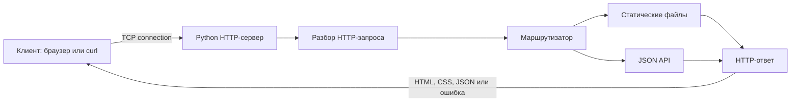
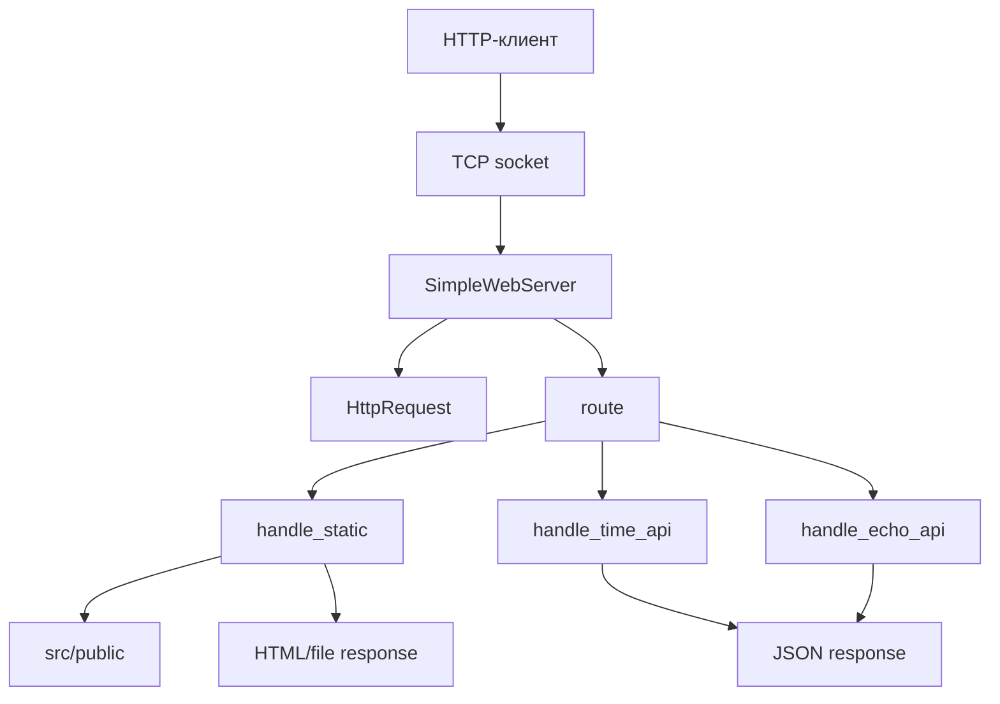
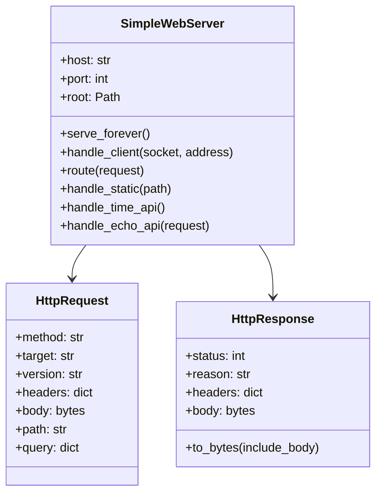
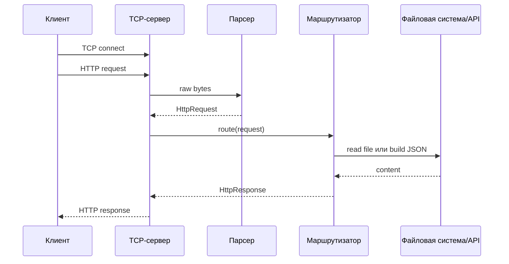
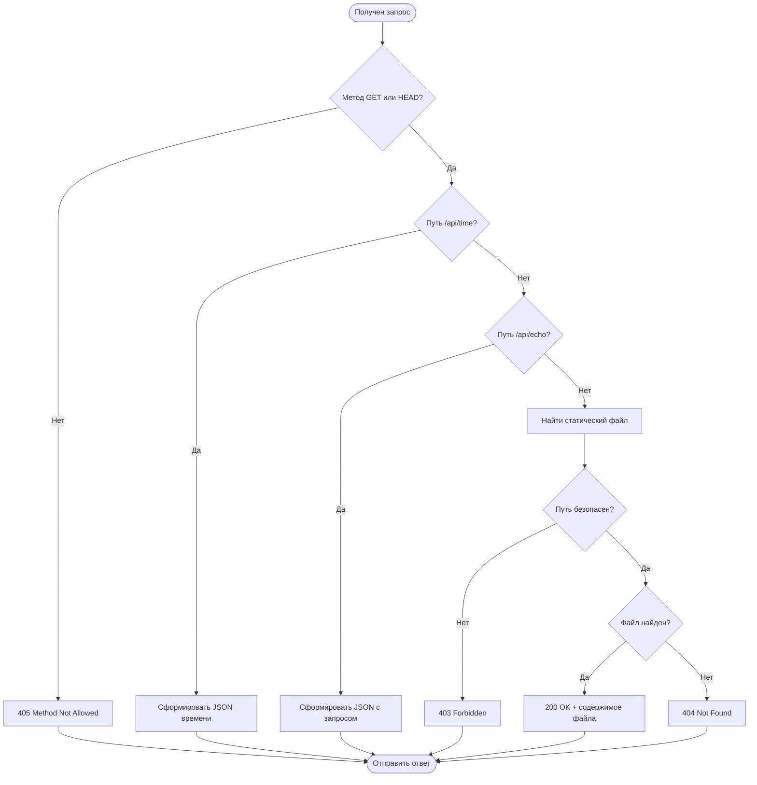
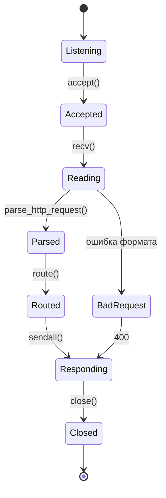
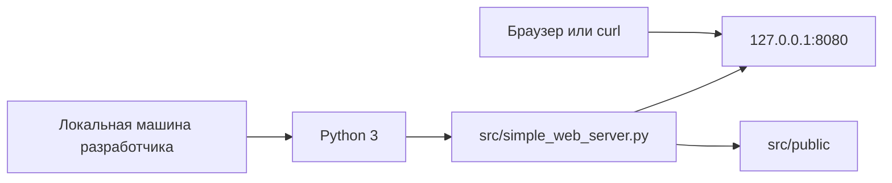
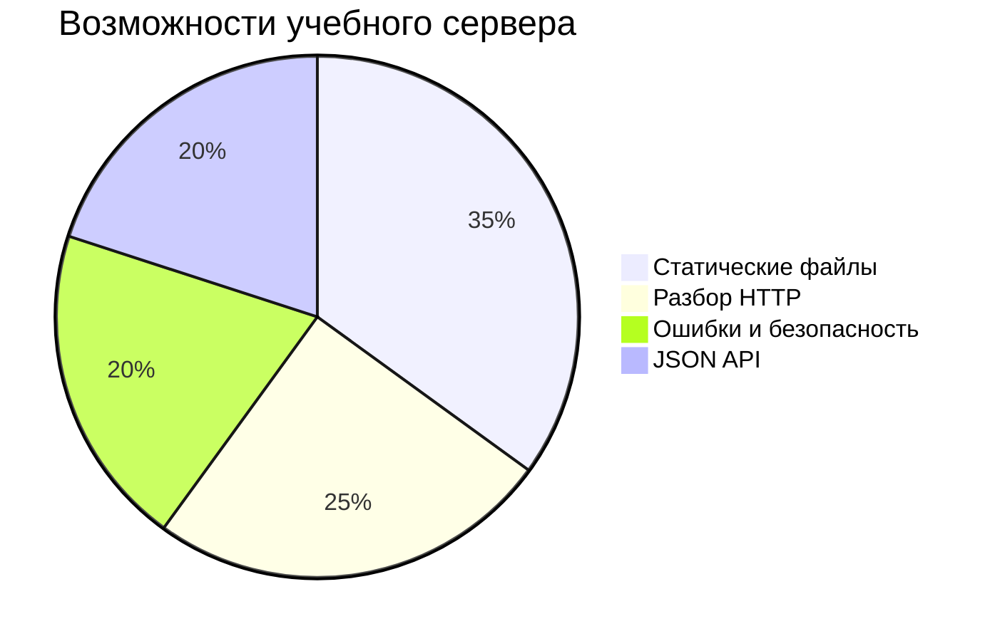

# Вариативная часть: Python: A Simple Web Server

## 1. Цель работы

Цель вариативной части - практически воспроизвести технологию `Python: A Simple Web Server` из подборки [`codecrafters-io/build-your-own-x`](https://github.com/codecrafters-io/build-your-own-x) и создать собственный учебный HTTP-сервер на Python.

В качестве исходного ориентира использован материал [A Simple Web Server](https://aosabook.org/en/500L/a-simple-web-server.html) из книги `500 Lines or Less`. В нем показана идея простого веб-сервера: принять HTTP-запрос, разобрать его, определить нужное действие, сформировать HTTP-ответ и отправить его клиенту.

В этой работе реализация сделана в директории `src/` без Flask, Django, FastAPI и других веб-фреймворков. Это позволяет увидеть базовые механизмы: TCP-сокет, формат HTTP-сообщений, маршрутизацию, отдачу файлов и обработку ошибок.

## 2. Результат

В репозитории добавлен мини-проект:

| Путь | Назначение |
|---|---|
| `src/simple_web_server.py` | Основной исходный код HTTP-сервера |
| `src/public/index.html` | Демонстрационная главная страница |
| `src/public/about.html` | Страница с описанием возможностей сервера |
| `src/public/styles.css` | Стили для HTML-страниц и страниц ошибок |
| `src/public/notes/readme.txt` | Файл внутри директории без `index.html` для проверки листинга |
| `docs/variant_task.md` | Подробное руководство и отчет |
| `docs/variant_journal.md` | Краткий журнал работ |

Сервер умеет:

- слушать TCP-порт;
- принимать HTTP/1.1-запросы;
- разбирать метод, путь, версию протокола и заголовки;
- обрабатывать `GET` и `HEAD`;
- отдавать статические файлы из `src/public`;
- автоматически отдавать `index.html` для директории;
- генерировать листинг директории, если `index.html` отсутствует;
- возвращать HTML-страницы ошибок;
- защищаться от path traversal;
- отдавать JSON API `/api/time` и `/api/echo`.

## 3. Последовательность исследования

Исследование выполнялось в следующей логике.

1. Был открыт репозиторий `codecrafters-io/build-your-own-x`.
2. В списке тем выбран раздел `Build your own Web Server`.
3. В качестве конкретной технологии выбран пункт `Python: A Simple Web Server`.
4. Изучена предметная область: TCP, сокеты, HTTP-запрос, HTTP-ответ, коды состояния.
5. Проанализирована идея исходного учебного материала: сервер получает запрос, выбирает обработчик и формирует ответ.
6. Для собственной реализации выбран более низкоуровневый подход через модуль `socket`, чтобы явно показать работу сетевого уровня.
7. Сформирован минимальный набор требований к серверу.
8. Реализован исходный код в `src/simple_web_server.py`.
9. Добавлены демонстрационные статические файлы.
10. Добавлена творческая модификация в виде JSON API.
11. Проведена локальная проверка.
12. Подготовлена документация и журнал.

## 4. Предметная область для начинающих

Веб-сервер - это программа, которая ждет входящие сетевые подключения, получает запросы от клиентов и отправляет ответы. Клиентом обычно выступает браузер, `curl`, мобильное приложение или другой сервер.

Основная цепочка выглядит так:

1. Клиент открывает TCP-соединение с сервером.
2. Клиент отправляет текстовый HTTP-запрос.
3. Сервер читает запрос.
4. Сервер определяет, что именно нужно вернуть.
5. Сервер формирует HTTP-ответ.
6. Клиент читает ответ и отображает результат.

### Иллюстрация 1. Общая схема обмена



### HTTP-запрос

Пример запроса:

```http
GET /about.html HTTP/1.1
Host: 127.0.0.1:8080
User-Agent: curl/8.0
Accept: */*
```

Первая строка называется стартовой строкой. Она содержит:

| Часть | Пример | Смысл |
|---|---|---|
| Метод | `GET` | Что клиент хочет сделать |
| Путь | `/about.html` | Какой ресурс нужен |
| Версия | `HTTP/1.1` | Версия протокола |

### HTTP-ответ

Пример ответа:

```http
HTTP/1.1 200 OK
Content-Type: text/html
Content-Length: 42
Connection: close

<html><body>Hello</body></html>
```

В ответе есть статус, заголовки и тело. Для браузера особенно важны `Content-Type` и `Content-Length`: первый сообщает тип данных, второй - размер тела ответа в байтах.

## 5. Архитектура проекта

### Иллюстрация 2. Компонентная диаграмма



Главный класс `SimpleWebServer` отвечает за жизненный цикл сервера: открыть порт, принять соединение, прочитать запрос, выбрать обработчик, отправить ответ.

Классы `HttpRequest` и `HttpResponse` являются простыми структурами данных. Они делают код понятнее: запрос и ответ передаются как объекты, а не как набор отдельных переменных.

### Иллюстрация 3. UML-диаграмма классов



## 6. Пошаговое руководство по созданию сервера

### Шаг 1. Подготовить структуру

Создаем директорию `src/` и файл сервера:

```text
src/
  simple_web_server.py
  public/
    index.html
    about.html
    styles.css
```

`public` - это корень статических файлов. Сервер не должен отдавать файлы выше этой директории.

### Шаг 2. Открыть TCP-сокет

Сервер начинается с обычного TCP-сокета:

```python
with socket.socket(socket.AF_INET, socket.SOCK_STREAM) as server_socket:
    server_socket.setsockopt(socket.SOL_SOCKET, socket.SO_REUSEADDR, 1)
    server_socket.bind((self.host, self.port))
    server_socket.listen(20)
```

Здесь:

| Выражение | Назначение |
|---|---|
| `AF_INET` | IPv4-сокет |
| `SOCK_STREAM` | TCP-соединение |
| `bind` | привязка к host и port |
| `listen` | переход в режим ожидания клиентов |

### Шаг 3. Принимать подключения

После запуска сервер входит в цикл:

```python
client_socket, client_address = server_socket.accept()
worker = threading.Thread(
    target=self.handle_client,
    args=(client_socket, client_address),
    daemon=True,
)
worker.start()
```

Для каждого клиента создается отдельный поток. Это учебное решение, которое позволяет нескольким запросам не блокировать друг друга.

### Иллюстрация 4. Диаграмма последовательности



### Шаг 4. Прочитать запрос

HTTP-заголовки заканчиваются пустой строкой `\r\n\r\n`. Поэтому сервер читает данные, пока не встретит этот разделитель:

```python
while True:
    chunk = client_socket.recv(4096)
    if not chunk:
        break
    chunks.append(chunk)
    if b"\r\n\r\n" in b"".join(chunks):
        return b"".join(chunks)
```

Также в реализации задан лимит `MAX_REQUEST_SIZE`, чтобы клиент не мог бесконечно отправлять заголовки и занимать память.

### Шаг 5. Разобрать HTTP-запрос

Функция `parse_http_request` разделяет запрос на стартовую строку, заголовки и тело:

```python
head, _, body = raw_request.partition(b"\r\n\r\n")
lines = head.decode("iso-8859-1").split("\r\n")
method, target, version = lines[0].split()
```

Далее заголовки превращаются в словарь:

```python
headers = {}
for line in lines[1:]:
    name, value = line.split(":", 1)
    headers[name.strip().lower()] = value.strip()
```

В учебном сервере тело запроса фактически не используется, потому что поддерживаются только `GET` и `HEAD`.

### Шаг 6. Выполнить маршрутизацию

Маршрутизация определяет, какой обработчик должен выполнить запрос:

```python
def route(self, request: HttpRequest) -> HttpResponse:
    if request.method not in {"GET", "HEAD"}:
        return self.error_response(405, "Method Not Allowed", "Only GET and HEAD are supported.")

    if request.path == "/api/time":
        return self.handle_time_api()

    if request.path == "/api/echo":
        return self.handle_echo_api(request)

    return self.handle_static(request.path)
```

Получается три группы запросов:

| Путь | Обработчик | Результат |
|---|---|---|
| `/api/time` | `handle_time_api` | JSON с текущим UTC-временем |
| `/api/echo` | `handle_echo_api` | JSON с параметрами запроса |
| остальные пути | `handle_static` | файл, индекс директории, листинг или ошибка |

### Иллюстрация 5. Activity diagram обработки запроса



### Шаг 7. Отдать статический файл

Статический файл читается как байты:

```python
content = file_path.read_bytes()
content_type = mimetypes.guess_type(file_path.name)[0] or "application/octet-stream"
return build_response(200, "OK", content, content_type)
```

Файлы открываются именно как байты, потому что сервер может отдавать не только HTML, но и CSS, изображения, архивы или другие бинарные данные.

### Шаг 8. Защититься от path traversal

Опасный запрос:

```http
GET /../../README.md HTTP/1.1
```

Если просто склеить путь из URL с директорией проекта, клиент сможет получить файлы вне `public`. Поэтому путь нормализуется и проверяется:

```python
decoded = unquote(raw_path)
normalized = posixpath.normpath(decoded).lstrip("/")
candidate = (self.root / normalized).resolve()
if candidate == self.root or self.root in candidate.parents:
    return candidate
return None
```

Если итоговый путь не находится внутри `src/public`, сервер возвращает `403 Forbidden`.

### Шаг 9. Сформировать HTTP-ответ

Ответ собирается из стартовой строки, заголовков и тела:

```python
header_lines = [f"HTTP/1.1 {self.status} {self.reason}"]
for key, value in self.headers.items():
    header_lines.append(f"{key}: {value}")
response_head = ("\r\n".join(header_lines) + "\r\n\r\n").encode("iso-8859-1")
return response_head + body
```

Функция `build_response` добавляет стандартные заголовки:

| Заголовок | Назначение |
|---|---|
| `Date` | время формирования ответа |
| `Server` | имя учебного сервера |
| `Content-Type` | тип данных |
| `Content-Length` | размер тела |
| `Connection` | закрытие соединения после ответа |

### Шаг 10. Поддержать `HEAD`

Метод `HEAD` похож на `GET`, но тело ответа не отправляется. Это полезно для проверки существования ресурса и чтения метаданных:

```python
include_body = not (request and request.method == "HEAD")
client_socket.sendall(response.to_bytes(include_body=include_body))
```

## 7. Состояния обработки соединения

### Иллюстрация 6. State diagram соединения



Такая диаграмма показывает, что соединение живет недолго: один запрос, один ответ, закрытие. Это упрощает реализацию и подходит для учебного проекта.

## 8. Развертывание и запуск

### Иллюстрация 7. Deployment diagram



Для запуска нужен только Python 3.

Команда запуска:

```bash
python3 src/simple_web_server.py --host 127.0.0.1 --port 8080 --root src/public
```

После запуска можно открыть:

```text
http://127.0.0.1:8080/
```

Проверка через `curl`:

```bash
curl -i http://127.0.0.1:8080/
curl -i http://127.0.0.1:8080/api/time
curl -I http://127.0.0.1:8080/about.html
curl -i http://127.0.0.1:8080/missing.html
curl --path-as-is -i http://127.0.0.1:8080/../../README.md
```

Ожидаемые ответы:

| Запрос | Ожидаемый статус | Смысл |
|---|---:|---|
| `/` | `200` | Отдан `index.html` |
| `/about.html` | `200` | Отдан статический файл |
| `/notes/` | `200` | Сгенерирован листинг директории |
| `/api/time` | `200` | Отдан JSON |
| `/missing.html` | `404` | Файл не найден |
| `/../../README.md` | `403` | Запрещенный выход из `public` |
| `POST /` | `405` | Метод не поддерживается |

## 9. Творческая модификация

В рамках творческой части сервер расширен за пределы простой отдачи HTML-файлов.

Добавлены JSON-маршруты:

| Маршрут | Назначение |
|---|---|
| `/api/time` | Возвращает имя сервера, текущее UTC-время и поясняющее сообщение |
| `/api/echo` | Возвращает метод, путь, query-параметры и заголовки запроса |

Пример ответа `/api/time`:

```json
{
  "server": "PracticeSimpleServer/1.0",
  "time_utc": "2026-05-11T11:39:03.846606+00:00",
  "message": "This endpoint is a creative extension of the basic static web server."
}
```

Эта модификация показывает, что веб-сервер может не только отдавать файлы, но и динамически генерировать данные. Такой подход лежит в основе веб-приложений и REST API.

### Иллюстрация 8. Соотношение возможностей сервера



## 10. Проверка выполненной реализации

Были выполнены следующие проверки:

```bash
python3 -m py_compile src/simple_web_server.py
```

Результат: файл успешно скомпилирован, синтаксических ошибок нет.

Также сервер был запущен локально:

```bash
python3 src/simple_web_server.py --host 127.0.0.1 --port 8091 --root src/public
```

Проверены HTTP-сценарии:

| Проверка | Результат |
|---|---|
| `GET /` | `HTTP/1.1 200 OK`, возвращена главная HTML-страница |
| `GET /api/time` | `HTTP/1.1 200 OK`, возвращен JSON |
| `HEAD /about.html` | `HTTP/1.1 200 OK`, тело не отправляется |
| `GET /missing.html` | `HTTP/1.1 404 Not Found`, возвращена HTML-страница ошибки |

## 11. Ограничения реализации

Проект учебный, поэтому в нем намеренно не реализованы некоторые возможности промышленного сервера:

| Ограничение | Почему допустимо в учебной работе |
|---|---|
| Нет HTTPS | Целью было изучение базового HTTP и сокетов |
| Нет keep-alive | Одно соединение на один запрос проще для понимания |
| Нет полноценной поддержки `POST` | Основной фокус - статические файлы и `GET` |
| Файлы читаются целиком | Для маленьких учебных файлов это достаточно |
| Потоки создаются напрямую | Это проще, чем пул потоков или async I/O |

## 12. Финальный отчет по этапам

1. Сначала была изучена формулировка вариативного задания: нужно выбрать технологию из `build-your-own-x`, воспроизвести практическую часть и оформить подробную документацию.
2. Затем была выбрана тема `Python: A Simple Web Server`, потому что она хорошо демонстрирует сетевое программирование, протокол HTTP и базовую архитектуру веб-приложений.
3. После выбора темы были изучены базовые материалы: репозиторий `codecrafters-io/build-your-own-x` и статья `A Simple Web Server`.
4. Далее были выделены ключевые технические понятия: TCP-соединение, сокет, HTTP-метод, URL-путь, заголовки, тело ответа и статус-коды.
5. Затем была спроектирована собственная реализация сервера на Python через стандартный модуль `socket`.
6. На следующем этапе был создан файл `src/simple_web_server.py` и реализованы основные структуры `HttpRequest`, `HttpResponse`, `SimpleWebServer`.
7. После этого была реализована обработка клиентских подключений, чтение байтов из сокета и разбор HTTP-запроса.
8. Затем была добавлена маршрутизация: статические файлы, JSON API и ошибки.
9. Далее была реализована безопасная работа с файловой системой, включая защиту от выхода за пределы `src/public`.
10. Затем добавлены демонстрационные HTML/CSS-файлы и директория для проверки листинга.
11. После базовой реализации выполнена творческая модификация: маршруты `/api/time` и `/api/echo`.
12. Затем проведена проверка компиляции и локальных HTTP-запросов.
13. На финальном этапе обновлен корневой `README.md`, подготовлены подробное руководство и журнал работ.

## 13. Вывод

В результате вариативной части был создан простой, но рабочий HTTP-сервер на Python. Проект показывает, что веб-сервер - это не магия фреймворка, а последовательность понятных операций: открыть сокет, принять запрос, разобрать текст HTTP, выбрать обработчик, сформировать ответ и отправить его клиенту.

Практическая ценность работы состоит в том, что после нее становится понятнее, какие задачи скрывают готовые веб-фреймворки: маршрутизация, безопасность путей, генерация заголовков, обработка ошибок и сериализация данных.
